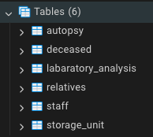
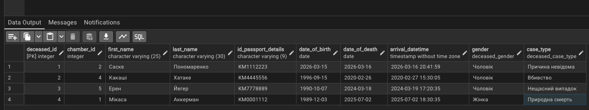
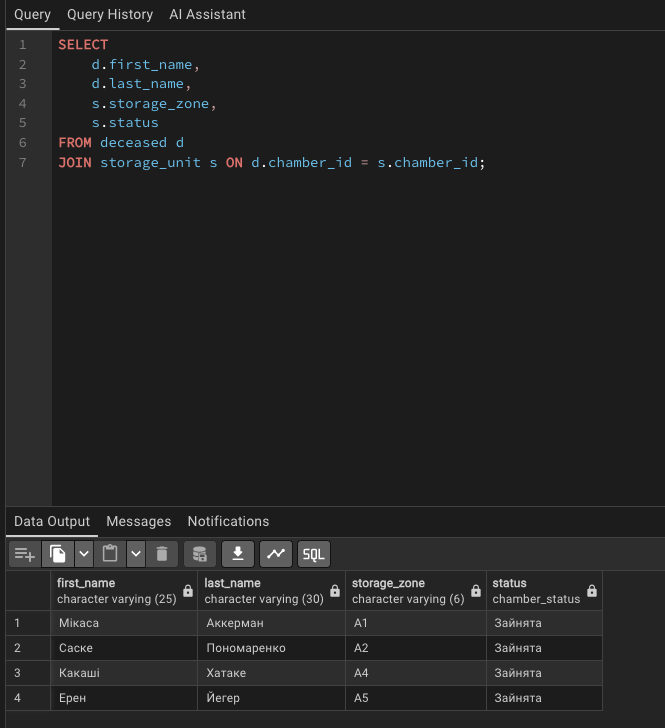
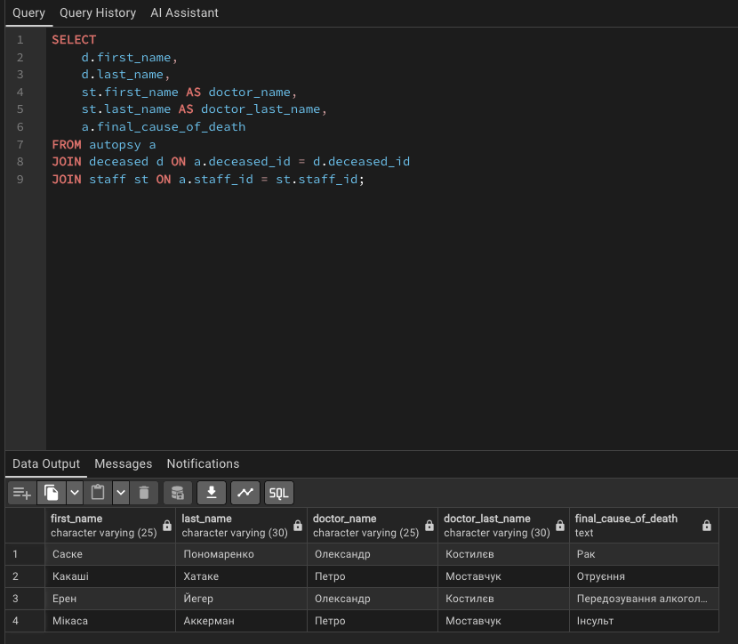
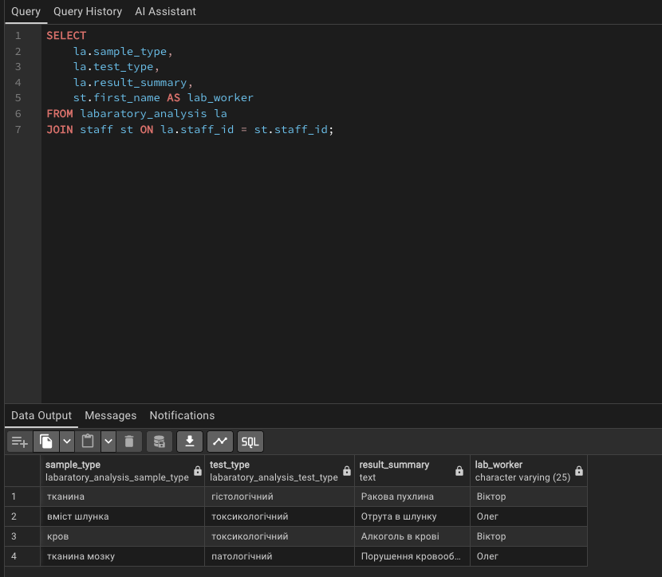

# Лабораторна робота №2

## Перетворення ER-діаграми на схему PostgreSQL

---

### Роботу виконали

Студенти групи ІО-46
Меджитова С.М., Орлик Д.В.

### Роботу перевірив

Русінов В.В.

---

## Мета роботи

Перетворити ER-діаграму предметної області на реляційну схему PostgreSQL, створити таблиці з відповідними типами даних, ключами та обмеженнями, а також заповнити їх тестовими даними.

---

## Опис

У даній роботі реалізовано базу даних для судово-медичної установи, яка дозволяє зберігати інформацію про:

* камери зберігання
* померлих
* родичів
* персонал
* розтини
* лабораторні аналізи

---

## Реляційна схема бази даних

* Deceased(deceased_id, chamber_id, first_name, last_name, id_passport_details, date_of_birth, date_of_death, arrival_datetime, gender, case_type)
* Staff(staff_id, id_passport_details, first_name, last_name, role, specialization, phone_number, mail)
* Storage_unit(chamber_id, storage_zone, status)
* Relatives(claimant_id, deceased_id, first_name, last_name, id_passport_details, contact_phone)
* Autopsy(autopsy_id, deceased_id, staff_id, start_datetime, end_datetime, final_cause_of_death)
* Labaratory_analysis(analysis_id, autopsy_id, staff_id, sample_type, test_type, result_summary)

## Опис таблиць

### 1. deceased

Інформація про померлих.

**Поля:**

* deceased_id — первинний ключ
* chamber_id — зовнішній ключ (камера)
* first_name - ім’я 
* last_name — прізвище
* date_of_birth — дата народження
* date_of_death — дата смерті
* id_passport_details — паспорт (унікальний)
* arrival_datetime — дата надходження
* gender — стать
* case_type — тип випадку

---

### 2. staff

Інформація про працівників установи.

**Поля:**

* staff_id — первинний ключ
* first_name - ім’я 
* last_name — прізвище
* id_passport_details — паспортні дані
* role — роль (лаборант / судмедексперт)
* specialization — спеціалізація
* phone_number — телефон (унікальний)
* mail — email (унікальний)

---

### 3. storage_unit

Містить інформацію про камери зберігання тіл.

**Поля:**

* chamber_id — первинний ключ
* storage_zone — зона зберігання
* status — статус камери (Вільна / Зайнята)

---

### 4. relatives

Інформація про родичів померлого.

**Поля:**

* claimant_id — первинний ключ
* deceased_id — зовнішній ключ
* first_name - ім’я 
* last_name — прізвище
* id_passport_details — паспорт (унікальний)
* contact_phone — телефон (унікальний)

---

### 5. autopsy

Інформація про проведені розтини.

**Поля:**

* autopsy_id — первинний ключ
* deceased_id — зовнішній ключ
* staff_id — зовнішній ключ
* start_datetime — початок
* end_datetime — кінець
* final_cause_of_death — причина смерті

---

### 6. labaratory_analysis

Інформація про лабораторні аналізи.

**Поля:**

* analysis_id — первинний ключ
* autopsy_id — зовнішній ключ
* staff_id — зовнішній ключ
* sample_type — тип зразка
* test_type — тип аналізу
* result_summary — результат

---

## Зв’язки між таблицями

### Родичі – померлий

* Тип: Many optional to many mandatory
* Померлий може мати багато родичів або жодного
* Родич може бути пов’язаний з одним або кількома померлими

---

### Померлий – камера зберігання

* Тип: One Mandatory to One Optional
* Кожен померлий обов’язково має камеру
* Камера може бути вільною або містити одного померлого

---

### Померлий – розтин

* Тип: One Mandatory to One Optional
* Померлий може мати один або жодного розтину
* Кожен розтин належить одному померлому

---

### Працівник – розтин – лабораторний аналіз

* Працівник проводить розтин
* Один розтин може мати багато аналізів
* Кожен аналіз виконується одним працівником

---

## SQL-реалізація

```sql
DO $$
BEGIN
  IF NOT EXISTS (SELECT 1 FROM pg_type WHERE typname = 'chamber_status') THEN
      CREATE TYPE chamber_status as ENUM ('Вільна', 'Зайнята');
  END IF;
END$$;

CREATE TABLE IF NOT EXISTS storage_unit
(
  chamber_id SERIAL PRIMARY KEY,
  storage_zone VARCHAR(6) NOT NULL,
  status chamber_status NOT NULL DEFAULT 'Вільна'

);

DO $$
BEGIN
  IF NOT EXISTS (SELECT 1 FROM pg_type WHERE typname = 'staff_role') THEN
    CREATE TYPE staff_role as ENUM ('Лаборант', 'Судмедексперт');
    END IF;
END$$;

CREATE TABLE IF NOT EXISTS staff
(
    staff_id SERIAL PRIMARY KEY,
    id_passport_details VARCHAR(9) NOT NULL,
    first_name VARCHAR(25) NOT NULL,
    last_name VARCHAR(30) NOT NULL,
    role staff_role NOT NULL,
    specialization VARCHAR(40) NOT NULL,
    phone_number VARCHAR(12) UNIQUE NOT NULL,
    mail VARCHAR(64) UNIQUE NOT NULL
);

DO $$
BEGIN
    IF NOT EXISTS (SELECT 1 FROM pg_type WHERE typname = 'deceased_gender') THEN
      CREATE TYPE deceased_gender AS ENUM ('Жінка', 'Чоловік');
    END IF;
END$$;

DO $$
BEGIN
    IF NOT EXISTS (SELECT 1 FROM pg_type WHERE typname = 'deceased_case_type') THEN
      CREATE TYPE deceased_case_type AS ENUM ('Природна смерть', 'Нещасний випадок', 'Вбивство', 'Самогубство', 'Причина невідома');
    END IF;
END$$;


CREATE TABLE IF NOT EXISTS deceased
(
    deceased_id SERIAL PRIMARY KEY,
    chamber_id INTEGER NOT NULL UNIQUE REFERENCES storage_unit(chamber_id),
    first_name VARCHAR(25) NOT NULL,
    last_name VARCHAR(30) NOT NULL,
    id_passport_details VARCHAR(9) UNIQUE NOT NULL,
    date_of_birth DATE NOT NULL,
    date_of_death DATE NOT NULL,
    arrival_datetime TIMESTAMP NOT NULL DEFAULT CURRENT_TIMESTAMP,
    gender deceased_gender NOT NULL,
    case_type deceased_case_type NOT NULL
);

CREATE TABLE IF NOT EXISTS relatives
(
    claimant_id SERIAL PRIMARY KEY,
    deceased_id INTEGER NOT NULL REFERENCES deceased(deceased_id),
    first_name VARCHAR(25) NOT NULL,
    last_name VARCHAR(30) NOT NULL,
    id_passport_details VARCHAR(9) UNIQUE NOT NULL,
    contact_phone VARCHAR(12) UNIQUE NOT NULL
);

CREATE TABLE IF NOT EXISTS autopsy 
(
  autopsy_id SERIAL PRIMARY KEY,
  deceased_id INTEGER NOT NULL UNIQUE REFERENCES deceased(deceased_id) ON DELETE CASCADE,
  staff_id INTEGER REFERENCES staff(staff_id),
  start_datetime TIMESTAMP NOT NULL,
  end_datetime TIMESTAMP,
  final_cause_of_death TEXT
);

DO $$
BEGIN
  IF NOT EXISTS (SELECT 1 FROM pg_type WHERE typname = 'labaratory_analysis_sample_type') THEN
      CREATE TYPE labaratory_analysis_sample_type AS ENUM 
    (
    'кров',
    'сеча',
    'тканина',
    'орган',
    'кістка',
    'вміст шлунка',
    'тканина легені',
    'тканина печінки',
    'тканина нирок',
    'тканина мозку',
    'волосся',
    'нігті'
    );
  END IF;
END$$;

DO $$
BEGIN
   IF NOT EXISTS (SELECT 1 FROM pg_type WHERE typname = 'labaratory_analysis_test_type') THEN
      CREATE TYPE labaratory_analysis_test_type AS ENUM 
    (
    'токсикологічний',
    'гістологічний',
    'біохімічний',
    'мікробіологічний',
    'днк аналіз',
    'патологічний'
    );
   END IF;
END$$;

CREATE TABLE IF NOT EXISTS labaratory_analysis
(
  analysis_id SERIAL PRIMARY KEY,
  autopsy_id INTEGER NOT NULL REFERENCES autopsy(autopsy_id) ON DELETE CASCADE,
  staff_id INTEGER NOT NULL REFERENCES staff(staff_id),
  sample_type labaratory_analysis_sample_type NOT NULL,
  test_type labaratory_analysis_test_type NOT NULL,
  result_summary TEXT NOT NULL
);

INSERT INTO storage_unit (storage_zone, status) VALUES
('A1', 'Зайнята'),
('A2', 'Зайнята'),
('A3', 'Вільна'),
('A4', 'Зайнята'),
('A5', 'Зайнята');

INSERT INTO staff (id_passport_details, first_name, last_name, role, specialization, phone_number, mail) VALUES
('CA2326790', 'Віктор', 'Поцілуйко', 'Лаборант', '1-й ступінь', '380661487692', 'viktor.pociluyko1980@gmail.com'),
('AC1022901', 'Олег', 'Цвірінько', 'Лаборант', '2-й ступінь', '380951789011', 'olezha.cvirinko111@gmail.com'),
('BA1026899', 'Олександр', 'Костилєв', 'Судмедексперт', 'Професор', '380981114923', 'kostiloleks68@gmail.com'),
('AB4110014', 'Петро', 'Моставчук', 'Судмедексперт', 'Кандидат наук', '380681123007', 'kostiloleks71@gmail.com');

INSERT INTO deceased (chamber_id, first_name, last_name, id_passport_details, date_of_birth, date_of_death, arrival_datetime, gender, case_type) VALUES
(2, 'Саске', 'Пономаренко', 'KM1112223', '2026-03-15', '2026-03-16', '2026-03-16 20:41:59', 'Чоловік', 'Причина невідома'),
(4, 'Какаші', 'Хатаке', 'KM4445556', '1996-09-15', '2020-02-26', '2020-02-27 15:30:05', 'Чоловік', 'Вбивство'),
(5, 'Ерен', 'Йегер', 'KM7778889', '1990-10-07', '2024-03-18', '2024-03-19 17:20:35', 'Чоловік', 'Нещасний випадок'),
(1, 'Мікаса', 'Аккерман', 'KM0001112', '1989-12-03', '2025-07-02', '2025-07-02 18:30:35', 'Жінка', 'Природна смерть');

INSERT INTO relatives (deceased_id, first_name, last_name, id_passport_details, contact_phone) VALUES
(1, 'Ітачі', 'Пономаренко', 'AA1234567', '380671234567'),
(2, 'Сакумо', 'Хатаке', 'AA7654321', '380501234567'),
(3, 'Григорій', 'Йегер', 'BB1234567', '380931112233'),
(4, 'Леві', 'Аккерман', 'CC9876543', '380661234567');

INSERT INTO autopsy (deceased_id, staff_id, start_datetime, end_datetime, final_cause_of_death) VALUES
(1, 3, '2026-03-18 12:14:57', '2026-03-18 15:31:10', 'Рак'),
(2, 4, '2020-02-29 11:29:15', '2020-02-29 16:10:28', 'Отруєння'),
(3, 3, '2024-03-21 09:18:00', '2024-03-21 11:23:09', 'Передозування алкоголем'),
(4, 4, '2025-07-04 10:00:00', '2025-07-04 12:16:49', 'Інсульт');

INSERT INTO labaratory_analysis (autopsy_id, staff_id, sample_type, test_type, result_summary) VALUES
(1, 1, 'тканина', 'гістологічний', 'Ракова пухлина'),
(2, 2, 'вміст шлунка', 'токсикологічний', 'Отрута в шлунку'),
(3, 1, 'кров', 'токсикологічний', 'Алкоголь в крові'),
(4, 2, 'тканина мозку', 'патологічний', 'Порушення кровообігу');
```

---
## Тестування

Для перевірки коректності роботи бази даних було виконано наступні дії:

### 1. Перевірка створення таблиць та типів

Було успішно створено всі таблиці та користувацькі типи даних у PostgreSQL.



---

### 2. Наповнення таблиць тестовими даними

У кожну таблицю було додано тестові записи (не менше 3 записів).



---

### 3. Перевірка SELECT-запитів

Було виконано ряд SQL-запитів для перевірки цілісності та зв’язків між таблицями:

- визначення розміщення тіл у камерах
- перегляд інформації про розтини
- аналіз лабораторних досліджень





---

### ✅ Висновок тестування

Усі SQL-запити виконуються без помилок.  
База даних працює коректно, зв’язки між таблицями реалізовані правильно.

## Результати

У результаті виконання роботи:

* створено реляційну схему бази даних
* реалізовано всі сутності ER-діаграми
* встановлено первинні та зовнішні ключі
* додано обмеження (UNIQUE, NOT NULL, CHECK, DEFAULT)
* виконано заповнення таблиць тестовими даними
* перевірено коректність роботи у pgAdmin

---

## Висновок

У ході лабораторної роботи було успішно перетворено ER-діаграму на реляційну модель PostgreSQL. Було закріплено навички створення таблиць, визначення типів даних, роботи з ключами та обмеженнями, а також наповнення бази тестовими даними.

Отримана база даних коректно відображає предметну область та забезпечує цілісність і узгодженість даних.
