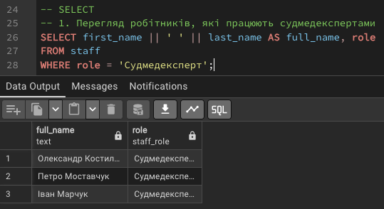
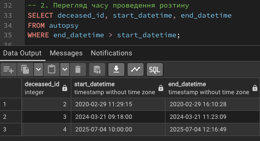
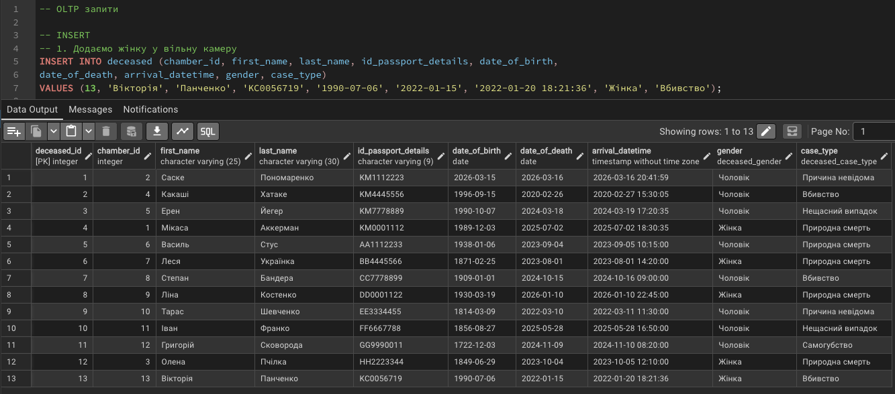
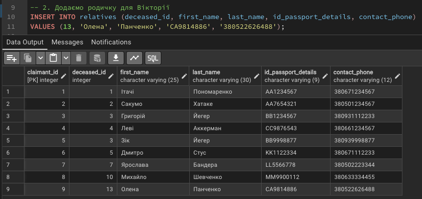
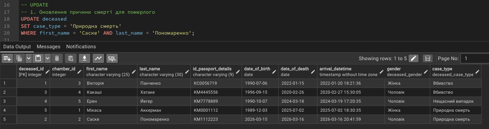
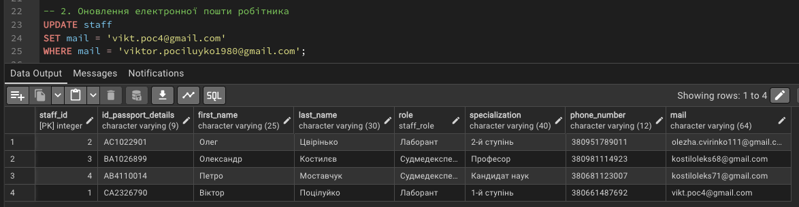
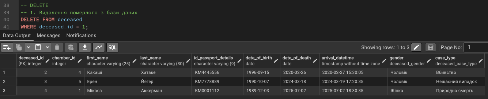
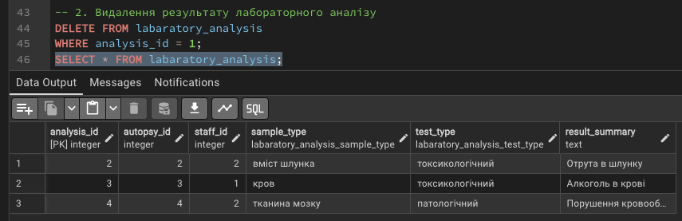

# Лабораторна робота №3

## Маніпулювання даними SQL (OLTP)

---

### Роботу виконали

Студенти групи ІО-46
Меджитова С.М., Орлик Д.В.

### Роботу перевірив

Русінов В.В.

---

## Мета роботи

Ознайомитися з операціями маніпулювання даними в PostgreSQL та набути практичних навичок використання SQL-запитів типу SELECT, INSERT, UPDATE і DELETE для роботи з базою даних у режимі OLTP.

---

## Цілі

* Написати запити SELECT для отримання даних (включаючи фільтрацію за допомогою WHERE та вибір певних стовпців).
* Практикувати використання операторів INSERT для додавання нових рядків до таблиць.
* Практикувати використання оператора UPDATE для зміни існуючих рядків (використовуючи SET та WHERE).
* Практикувати використання операторів DELETE для безпечного видалення рядків (за допомогою WHERE).
* Вивчити основні операції маніпулювання даними (DML) у PostgreSQL та спостерігати за їхнім впливом.

---

## Хід роботи

### 1. Отримання даних (SELECT)

Було виконано запити для отримання даних з таблиць бази даних.

```sql
-- SELECT
-- 1. Перегляд робітників, які працюють судмедекспертами
SELECT first_name || ' ' || last_name AS full_name, role
FROM staff
WHERE role = 'Судмедексперт';
```


```sql
-- 2. Перегляд часу проведення розтину
SELECT deceased_id, start_datetime, end_datetime
FROM autopsy
WHERE end_datetime > start_datetime;
```


### 2. Додавання даних (INSERT)

Було додано нові записи до таблиць бази даних за допомогою оператора INSERT.

```sql
-- INSERT
-- 1. Додавання жінки до таблиці померлих
INSERT INTO deceased (chamber_id, first_name, last_name, id_passport_details,
            date_of_birth, date_of_death, arrival_datetime, gender, case_type)
VALUES
  (3, 'Вікторія', 'Панченко', 'KC0056719', '1990-07-06', '2022-01-15', '2022-01-20 18:21:36', 'Жінка', 'Вбивство');
```


```sql
-- 2. Додавання родича до таблиці родичів
INSERT INTO relatives (deceased_id, first_name, last_name, id_passport_details, contact_phone)
VALUES
  (5, 'Олена', 'Панченко', 'CA9814886', '380522626488');
```


### 3. Оновлення даних (UPDATE)

Було виконано оновлення існуючих записів у таблицях бази даних за допомогою оператора UPDATE із використанням умов WHERE.

```sql
-- UPDATE
-- 1. Оновлення причини смерті для померлого
UPDATE deceased
SET case_type = 'Природна смерть'
WHERE first_name = 'Саске' AND last_name = 'Пономаренко';
```


```sql
-- 2. Оновлення електронної пошти робітника
UPDATE staff
SET mail = 'vikt.poc4@gmail.com'
WHERE mail = 'viktor.pociluyko1980@gmail.com';
```



### 4. Видалення даних (DELETE)

Було виконано видалення записів із таблиць бази даних за допомогою оператора DELETE із використанням умов WHERE.

```sql
-- DELETE
-- 1. Видалення померлого з бази даних
DELETE FROM deceased
WHERE deceased_id = 1;
```


```sql
-- 2. Видалення результату лабораторного аналізу
DELETE FROM labaratory_analysis
WHERE analysis_id = 1;
```



---

## Результати

У ході виконання лабораторної роботи було виконано SQL-запити для отримання, додавання, оновлення та видалення даних. Було перевірено коректність виконання кожної операції за допомогою SELECT-запитів. Отримані результати підтверджують правильність роботи з базою даних.

---

## Висновок

У ході виконання лабораторної роботи ми навчились працювати з операторами маніпулювання даними в PostgreSQL. Ми виконали запити SELECT, INSERT, UPDATE та DELETE, а також перевірили їхню роботу на практиці. У результаті ми зрозуміли принципи роботи OLTP-запитів та навчились безпечно змінювати дані в таблицях.
