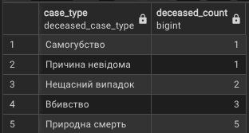
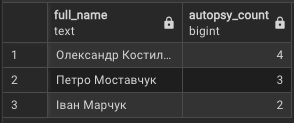
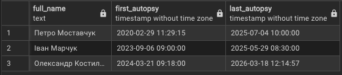
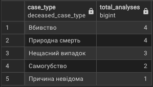
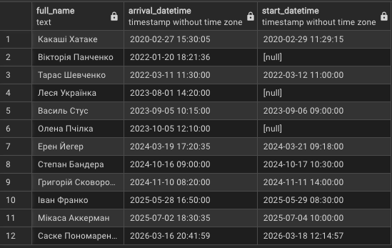
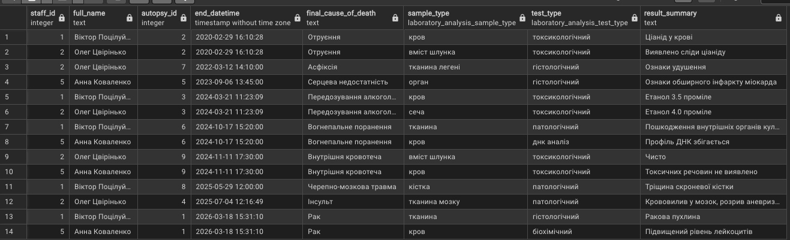
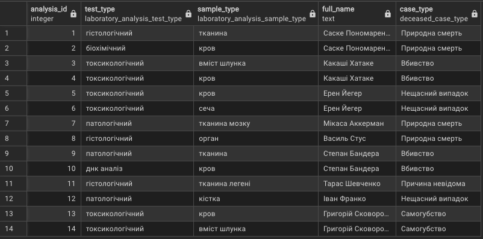
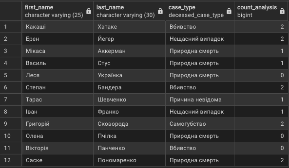
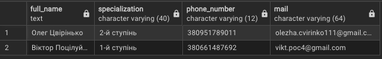
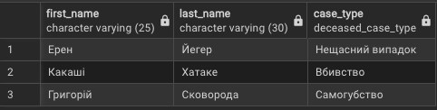

# Лабораторна робота №4

## Аналітичні SQL-запити (OLAP)
---

### Роботу виконали

Студенти групи ІО-46
Меджитова С.М., Орлик Д.В.

### Роботу перевірив

Русінов В.В.

---

## Мета роботи

Ознайомлення з аналітичними SQL-запитами (OLAP), використання агрегатних функцій, групування даних, об'єднання таблиць (JOIN) та підзапитів для отримання узагальненої інформації з бази даних.

---

## Цілі

* Використовувати агрегатні функції, такі як COUNT, SUM, AVG, MIN та MAX, для обчислення зведеної статистики з ваших даних.
* Написати запити GROUP BY для групування рядків за одним або кількома стовпцями та обчислення агрегатів для кожної групи.
* Використовувати HAVING для фільтрації результатів згрупованих запитів на основі агрегованих умов.
* Виконувати операції JOIN (принаймні INNER JOIN та LEFT JOIN), щоб об'єднати дані з кількох таблиць.
* Створювати об'єднані запити на агрегацію для кількох таблиць, які об'єднують таблиці та створюють згрупований, агрегований вивід.
* Інтерпретувати результати ваших запитів та пояснити, що робить кожен з них.

---

## Хід роботи

### 1. Запити з агрегатними функціями 

```sql
-- Статистика причин потрапляння до моргу
SELECT case_type, COUNT(deceased_id) AS deceased_count
FROM deceased
GROUP BY case_type
ORDER BY deceased_count ASC;
```


Даний запит використовується для аналізу розподілу причин смерті серед усіх померлих. За допомогою GROUP BY відбувається групування записів за полем case_type, 
після чого функція COUNT дозволяє підрахувати кількість випадків для кожної причини. Сортування за зростанням дає можливість побачити найменш поширені причини на початку вибірки.

--- 

```sql
-- Кількість проведених розтинів у судмедекспертів
SELECT s.first_name || ' ' || s.last_name AS full_name, 
COUNT(a.autopsy_id) AS autopsy_count
FROM staff s
JOIN autopsy a ON s.staff_id = a.staff_id
GROUP BY s.staff_id, s.first_name, s.last_name
ORDER BY autopsy_count DESC;
```


Цей запит дозволяє оцінити навантаження на кожного працівника. За рахунок об’єднання таблиць staff та autopsy визначається, скільки розтинів виконав кожен судмедексперт.

--- 

```sql
-- Найраніша та найпізніша дата розтину для кожного судмедексперта
SELECT s.first_name || ' ' || s.last_name AS full_name, 
MIN(a.start_datetime) AS first_autopsy, 
MAX(a.start_datetime) AS last_autopsy
FROM staff s
JOIN autopsy a ON s.staff_id = a.staff_id
GROUP BY s.staff_id, s.first_name, s.last_name
ORDER BY first_autopsy;
```


Запит спрямований на визначення часових меж роботи кожного судмедексперта. 
Використання агрегатних функцій MIN та MAX дозволяє знайти перший і останній зафіксований розтин для кожного працівника. 
Це дає змогу проаналізувати період активності співробітників.

--- 

```sql
--Кількість лабораторних аналізів по кожному типу смерті
SELECT 
    d.case_type,
    COUNT(la.analysis_id) AS total_analyses
FROM deceased d
JOIN autopsy a ON d.deceased_id = a.deceased_id
JOIN laboratory_analysis la ON a.autopsy_id = la.autopsy_id
GROUP BY d.case_type
ORDER BY total_analyses DESC;
```


Даний запит поєднує кілька таблиць. Він підраховує, скілбки лабораторних аналізів було проведено для кожного типу смерті. 
Таким чином можна побачити, які випадки потребують більш детального дослідження та супроводжуються більшою кількістю аналізів.

---

### 2. Запити з операціями JOIN, щоб об'єднати дані з кількох таблиць:

```sql
-- Порівняння дат привезення та початку розтину
SELECT d.first_name || ' ' || d.last_name AS full_name, d.arrival_datetime, s.start_datetime
FROM deceased d
LEFT JOIN autopsy s ON s.deceased_id = d.deceased_id
ORDER BY d.arrival_datetime ASC, s.start_datetime ASC;
```


У цьому запиті використовується LEFT JOIn для того, щоб включити всіх померлих незалежно від того, чи був проведений розтин. 
Це дозволяє порівняти дату надходження тіла до моргу та дату початку розтину, а також виявити випадки, коли розтин ще не проводився (значення буде NULL).

---

```sql
-- Хто який лабораторний аналіз робив за зростанням в часі
SELECT s.staff_id, s.first_name || ' ' || s.last_name AS full_name, a.autopsy_id, a.end_datetime, a.final_cause_of_death,
la.sample_type, la.test_type, la.result_summary
FROM staff s
INNER JOIN laboratory_analysis la ON la.staff_id = s.staff_id
INNER JOIN autopsy a ON a.autopsy_id = la.autopsy_id
ORDER BY a.end_datetime, staff_id ASC, a.autopsy_id ASC;
```


Запит створений для отримання детальної інформації про виконані лабораторні аналізи. Завдяки INNER JOIN об’єднуються лише ті записи, для яких існує відповідність у всіх таблицях (працівник, аналіз і розтин). 
Це дозволяє простежити, хто саме виконував аналіз, для якого розтину та які результати були отримані.

---

```sql
-- Детальні аналізи всіх померлих
SELECT la.analysis_id, la.test_type, la.sample_type, d.first_name || ' ' || d.last_name AS full_name, d.case_type
FROM deceased d
RIGHT JOIN autopsy a ON d.deceased_id = a.deceased_id
RIGHT JOIN laboratory_analysis la ON a.autopsy_id = la.autopsy_id
ORDER BY la.analysis_id;
```


Даний запит орієнтований на отримання повного списку лабораторних аналізів. Використання RIGHT JOIN значить, 
що всі записи з таблиці laboratory_analysis будуть включені у результат, навіть якщо інформація про померлого або розтин є неповною.

---

### 3. Запити з використанням підзапитів (вибірка з підзапитом у SELECT, WHERE, або HAVING):

```sql
-- Cписок усіх померлих і скільки лабораторних аналізів для кожного з них було замовлено
SELECT 
    first_name, 
    last_name,
    case_type,
    (
        SELECT COUNT(*) 
        FROM laboratory_analysis la
        JOIN autopsy a ON la.autopsy_id = a.autopsy_id
        WHERE a.deceased_id = deceased.deceased_id
    ) AS count_analysis
FROM deceased;
```


Цей запит показує, скільки лабораторних аналізів було проведено для кожного померлого. Основна частина просто виводить first_name, last_name і case_type.
У вкладеному SELECT стоїть COUNT(*) і перевірка WHERE a.deceased_id = deceased.deceased_id тобто для кожного конкретного померлого рахується кількість аналізів, які з ним пов’язані через таблицю autopsy.

Фактично, для кожного рядка окремо рахується своє значення, тому в результаті ми одразу бачимо і дані людини, і кількість її аналізів.

---

```sql
--Працівники, які виконали більше всього аналізів
SELECT s.first_name || ' ' || s.last_name AS full_name, s.specialization, s.phone_number, s.mail
FROM staff s
WHERE (
    SELECT COUNT(*) 
    FROM laboratory_analysis la
    WHERE la.staff_id = s.staff_id
) = (
    SELECT MAX(cnt)
    FROM (
        SELECT COUNT(*) AS cnt
        FROM laboratory_analysis
        GROUP BY staff_id
    ) sub
);
```


Запит шукає працівників, які зробили найбільше аналізів. Спочатку в підзапиті ```SELECT COUNT(*) FROM laboratory_analysis WHERE la.staff_id = s.staff_id ``` для кожного працівника рахується кількість його аналізів. Далі ще один вкладений запит знаходить максимум серед усіх цих значень: ```SELECT MAX(cnt) FROM (SELECT COUNT(*) AS cnt ... ) sub``` в основному WHERE йде порівняння, якщо кількість аналізів працівника дорівнює максимуму, він потрапляє у результат.

Тобто спочатку знаходимо максимум, потім шукаємо, хто йому відповідає.

---

```sql
--Померлі, у яких є токсикологічний аналіз
SELECT 
    d.first_name,
    d.last_name,
    d.case_type
FROM deceased d
WHERE d.deceased_id IN (
    SELECT a.deceased_id
    FROM autopsy a
    JOIN laboratory_analysis la ON la.autopsy_id = a.autopsy_id
    WHERE la.test_type = 'токсикологічний'
);
```


Цей запит відбирає тільки тих померлих, у яких був токсикологічний аналіз. У підзапиті: ```WHERE la.test_type = 'токсикологічний'``` ми отримуємо всі deceased_id, для яких такий аналіз існує. А вже в основному запиті використовується: ```WHERE d.deceased_id IN ()``` тобто перевіряється, чи входить померлий у цей список.

---

## Висновок

У ході виконання лабораторної роботи було використано агрегатні функції для обчислення статистичних показників, реалізовано групування даних за допомогою GROUP BY, застосовано різні типи JOIN для об'єднання таблиць. 
Крім того, були використані підзапити для отримання більш складних аналітичних результатів. Отримані результати підтверджують ефективність використання SQL для аналізу даних.
